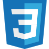

<h1>Hi there 👋</h1>

<h2>I'm <strong>Aarón Sosa</strong> (_a.k.a. aasoru_).</h2>

I'm a passionate Web Developer specializing in backend and frontend development with technologies like <strong>Laravel, React, Nextjs, and Tailwind</strong>. Currently, I'm learning and improving in backend development, with technologies like <strong>Node.js, MySQL, MongoDB and many others</strong>.

<h2 align="center">Skills</h2>

<h2 align="center">Top Languages</h2>

<!--START_SECTION:waka-->
<!--END_SECTION:waka-->

